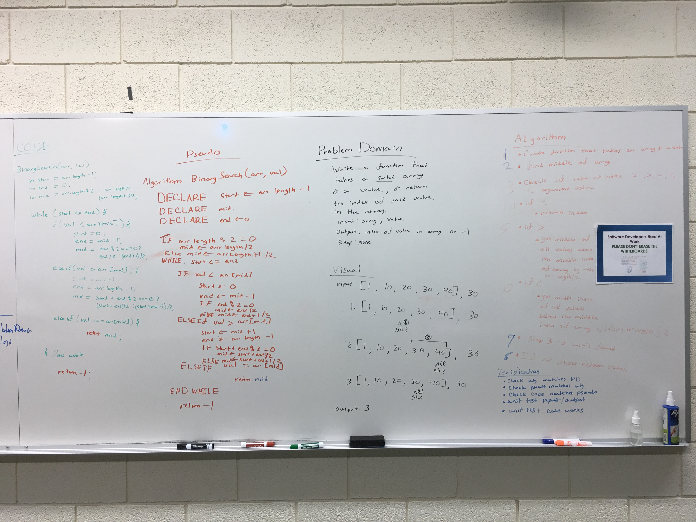

# Binary search
Write a function that takes an array and a value, and returns the index of the value in the array, or -1 if not found.

## Challenge
I need to write a function that takes an array and a number and finds the index of said number inside of said array

## Approach & Efficiency
I used start, end and mid variables to control which group of values in the array I am working with and a mid value to check against the argument value. This allows me to efficiently find mid using a while loop which checks if the value is larger or smaller than the mid.

## Solution
