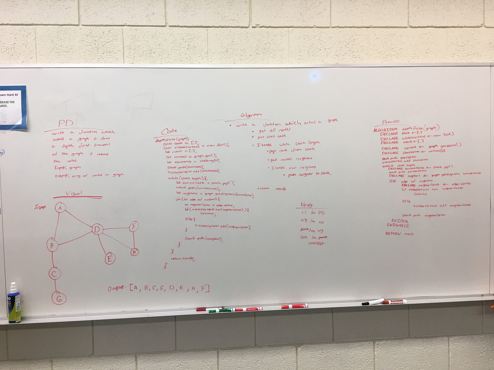

# Challenge Summary
Write a depth first traversal function for a graph

## Challenge Description
Write a function that traverses a graph using a depth first traversal. This means that the graph will start at the "root" vertex and move to the bottom of the graph before working it's way down other avenues. 

## Approach & Efficiency
My approach was to use loops rather than recursion. I utilize a stack where I push vertices, and then pop them to send them through a series of loops placing them in the results array, getting their neighbors, and starting the process over for their neighbors. 

## Solution
