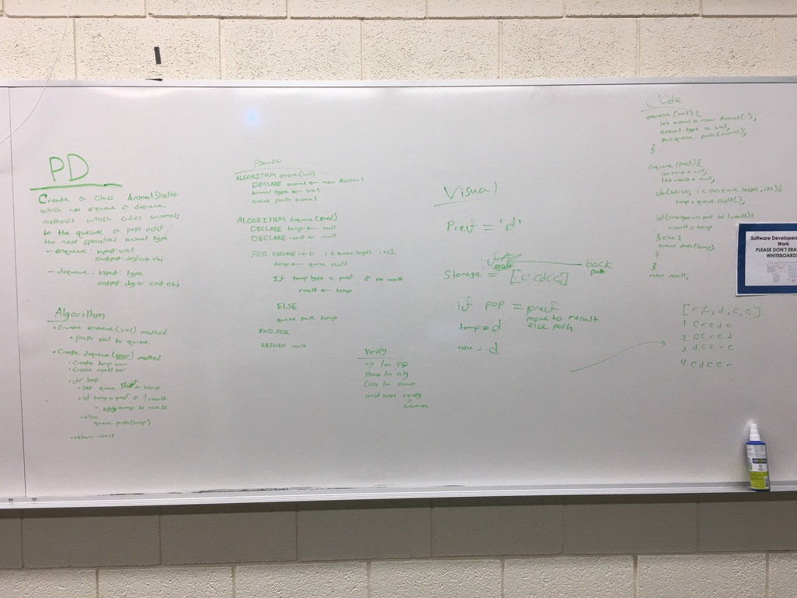

# fifo Animal Shelter
Create a queue which takes cats and dogs

## Challenge
Implement dequeue and enqueue, where enqueue adds animals to the queue and dequeue removes the oldest animal of the specified type out of the queue

## Approach & Efficiency
I utilized a temp variable and a for loop in order to remove the correct animal from the queue while keeping it in place

## API
###Enqueue
Add an Animal at the back of the queue

###Dequeue
Remove the oldest animal of the specified type from the queue

## Solution

