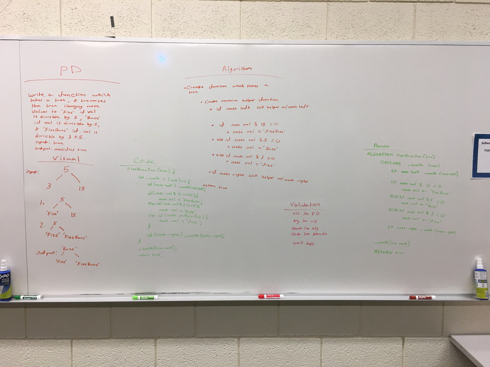

# Fizz Buzz Tree
Write a function called FizzBuzzTree which takes a tree as ana rgument

## Challenge
This function traverses the tree changing node values to 'Fizz' if value is divisuble by 3, 'Buzz' if
value is divisible by 5, or 'FizzBuzz' if value is divisible by 15 and returns the modified tree.

## Approach & Efficiency
I utilized recursion as well as a fizzCheck function. The fizzBuzzTree runs inside of it a recursive _walk() 
helper function which traverses the tree using inOrder traversal, and then calls fizzCheck() which handles the 
modulus comparisons.

###API
#### FizzBuzzTree(tree)

## Solution

