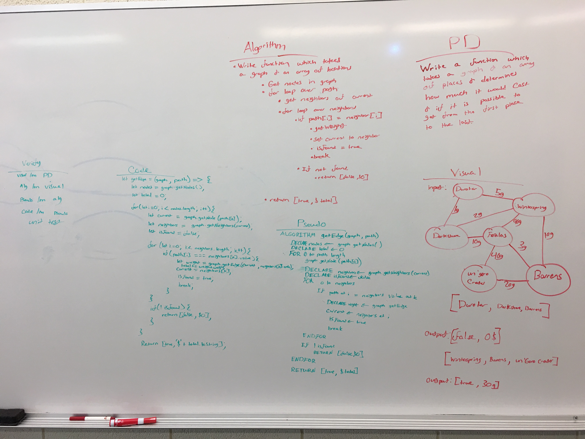

# Challenge Summary
Write a function which takes a graph and an array of locations and returns the price it takes to get to that location

## Challenge Description
Write a function which traverses a graph through a given path and determine if the path is possible, and determine how much it costs based on the edge weight. The goal is to return a string in the format of 'false $0' or 'true $n' based on the outcome.

## Approach & Efficiency
I utilized three for loops. One loop to get the current node, one loop to loop over the path, and another to loop over the neighbors. In this way we find if the path exists by finding if the next location is a neighbor of the current node. If not false is immediately returned, else the traversal continues until either the goal node is found or false if not. 

## Solution
