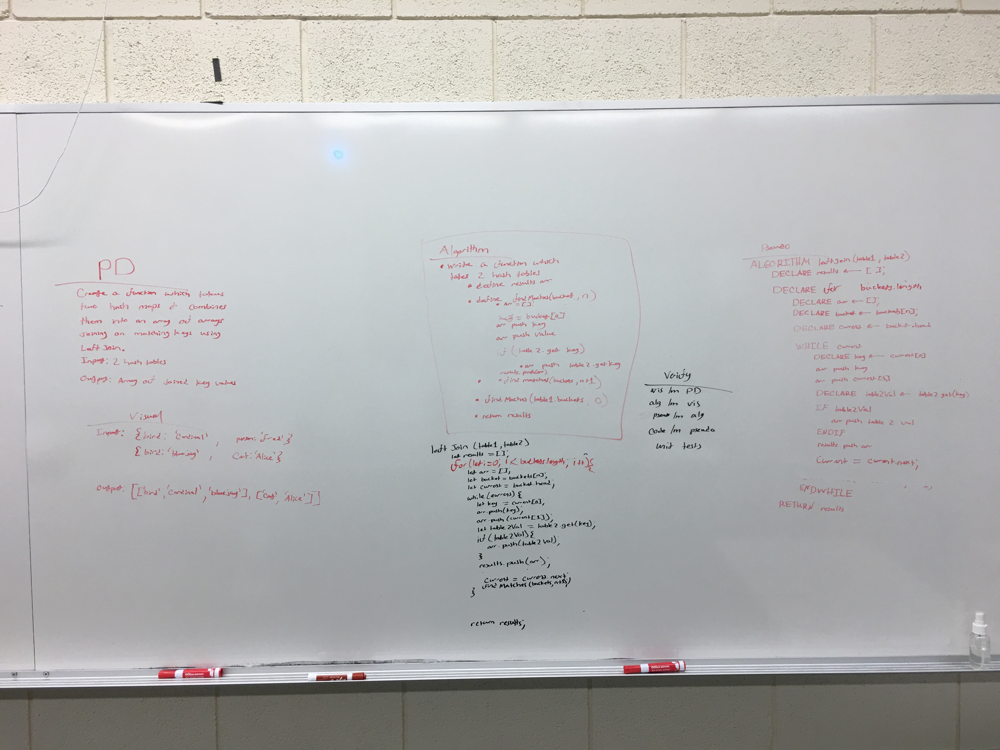

# Challenge Summary
Write a function which takes two hash maps and uses left join to combine them into nested arrays and return the array

## Challenge Description
Create a function called leftJoin whcih takes two hash maps and combines them into an array of arrays joining on matching keys using left join. When a key matches between both tables, the key is pushed into the array, the value of the first table is then pushed into the array, and finally the value of the second tree is pushed. If the second tree does not have a value then null is pushed. 

## Approach & Efficiency
For this algorithm I utilized a for loop for traversing the buckets and an inner while loop used for traversing the linked lists. I push the first table's bucket's value's key into the array, then the value, then I use the second table's get function to find if the key exists in the second table. if so, push the value, else push null. I then push that populated array into the results array and finally return the results array

## Solution
