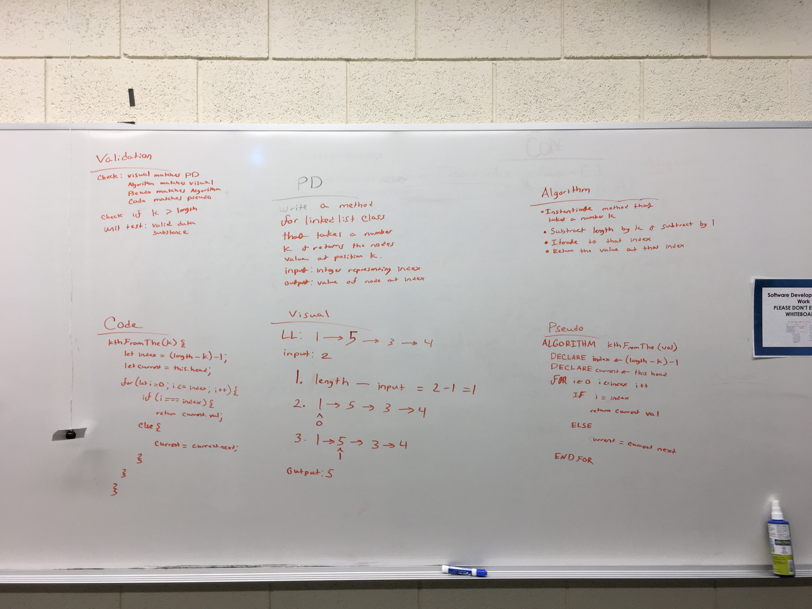

# Linked List
Create a linked list data structure using class syntax

## Challenge
Create insert, includes, and print methods for Linked list class

## Approach & Efficiency
I utilized class syntax to create a node and linkedlist class and implemented insert, includes, and print methods to make a functioning list. 

## API
###Insert (add front)
Takes a value and nserts it into the beginning of the array and resets the head to that new node

###Includes
Takes a value and iterates over the linked list and returns true if value is found and false if not

###Print
console logs each value in the linked list and returns an array of all the values in the linked list

###append
Appends a value to the end of the link list

###appendBefore
Appends a node before the specified node

###appendAfter
Append a node after the specified node

####kthAfterEnd
returns value of node given index from end of LinkedList

## Solution

