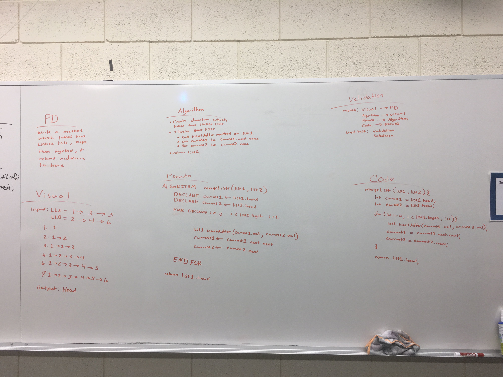

# mergeLists(list1, list2)
Function that takes two linked lists and zips them together

## Challenge
create a function that combines two linked lists into one

## Approach & Efficiency
I modified list 1 to take on both lists rather than creating a third list do to space

## Solution

