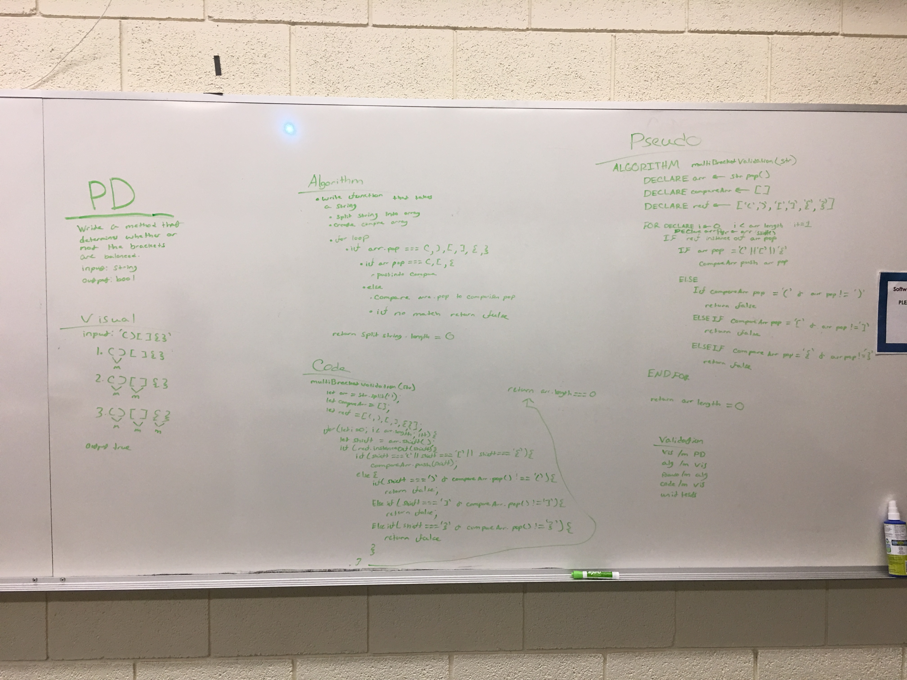

# Multi Bracket Validation
Write a function which takes a string and determines whether or not the brackets are balanced

## Challenge
The challenge here is you can only register open and closing brackets and have to filter out any other characters. 

## Approach & Efficiency
I utilized a stack so I could continually shift characters from the array to be compared 

## API
###multiBracketValidation(input)
Takes a string and determines of the brackets are balanced

## Solution

