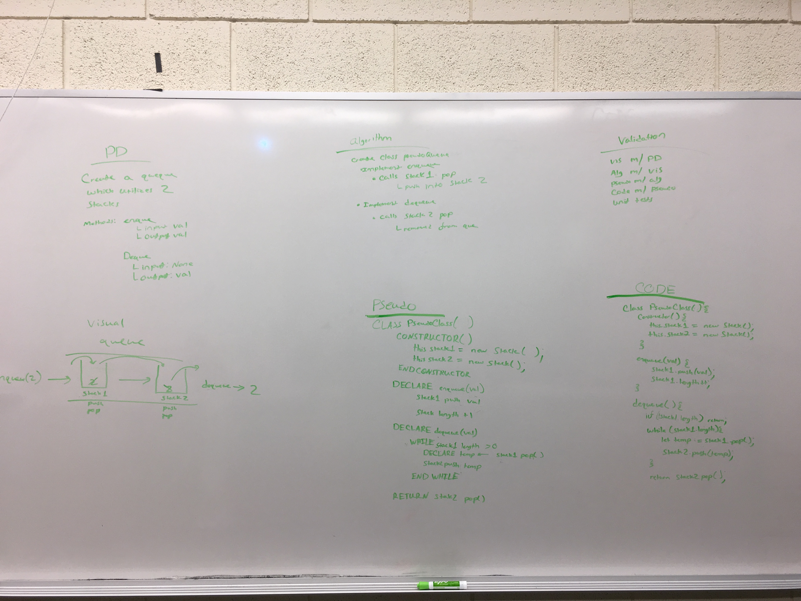

# Queues with Stacks
Create a queue class utilizing 2 stacks

## Challenge
Implement enqueue and dequeue to work with two stacks rather than queue methods

## Approach & Efficiency
Implemented enqueue and dequeue to utilize stack methods

## API
###enqueue
Calls stack1.push()

###pop
Move all nodes from stack 1 into stack 2 and pop off the top element and returns it's value

## Solution

