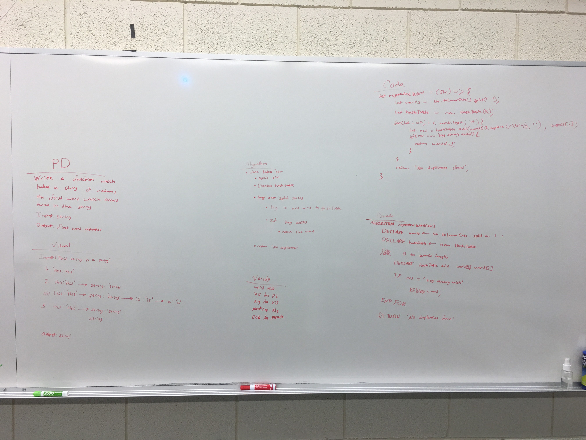

# repeatedWord(string)
Function which takes a string and returns the first two duplicated words of that string

## Challenge
This challenge is to write a function which can take a string, finds the first word found twice in the string, and returns it. The challenge is you must modify the string and test different parts of the string again previous parts of the string to determine duplicates. 

## Approach & Efficiency
To find the first word that appears twice in the string I utilized a hash table. The algorithm adds the words to the hashTable and when the hashtable encounters a key that already exists then that is the first word that appears twice in the string. That word is then returned. 

## Solution
