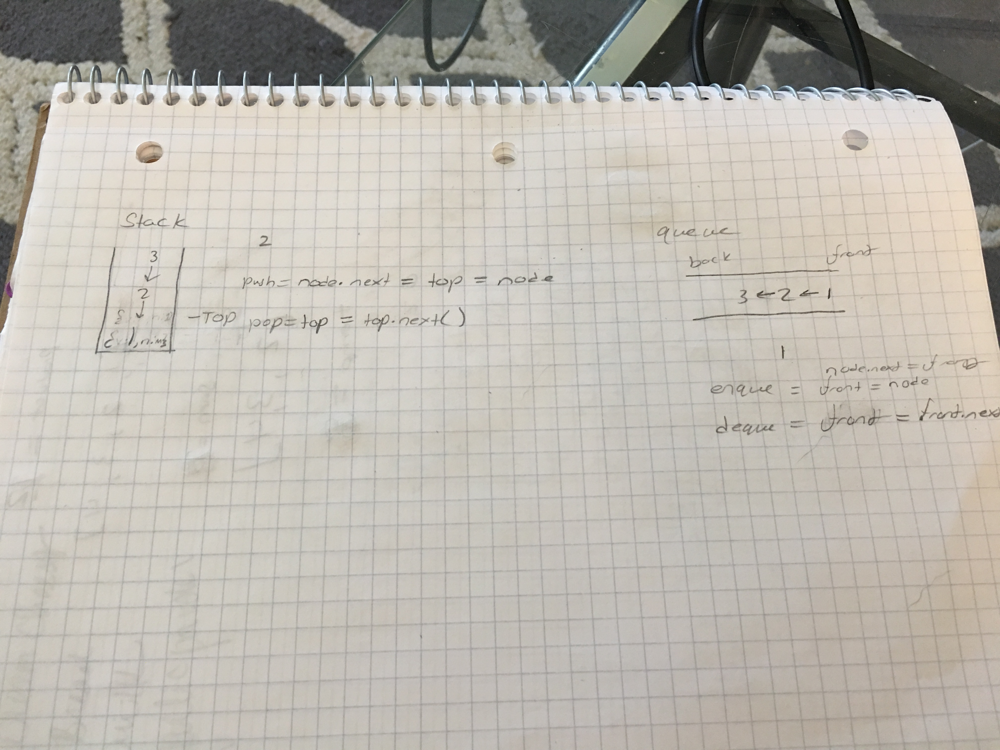

# Stacks and Queues
Create a stack class and queue class

## Challenge
Implement push, pop, and peak for stack
Implement enqueue, dequeue, and peek for queue

## Approach & Efficiency
I utilized class syntax to create a node and Stack, and Queue classes and implemented methods inside of the classes.

## API
###push
Takes a value and nserts it into the back of the stack and resets the top to that new node

###pop
Removes the top item from the stack

###Peek
Returns the value of the top node

###Enqueue
Add a node at the back of the queue

###Dequeue
Remove the node from the front of the queue and reset the front to the next node

## Solution

