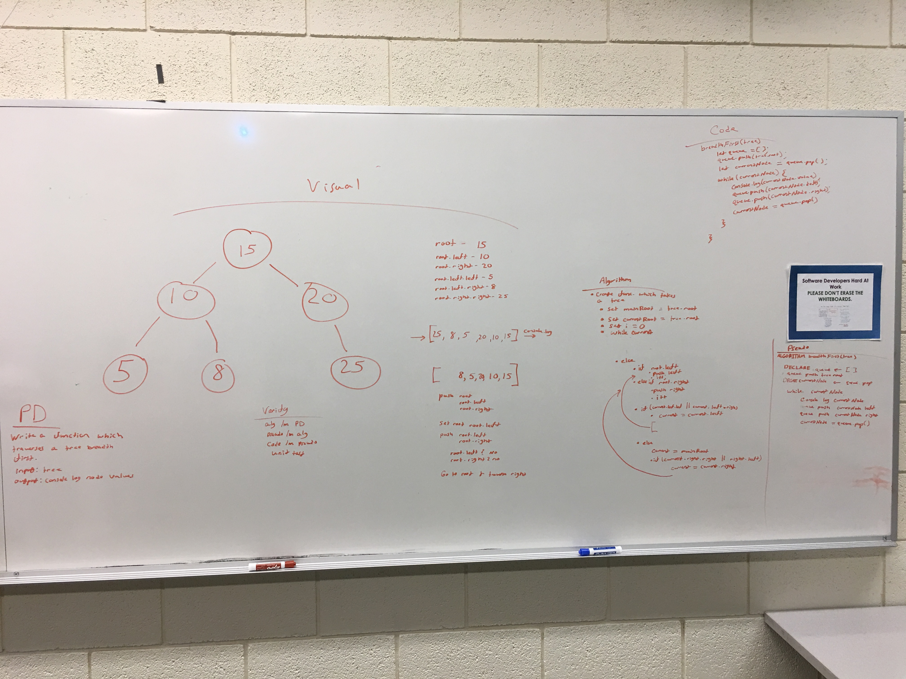

# Trees
Create BinaryTree and BinarySearchTree classes with their own set of methods

## Challenge
Implement inOrder, preOrder, and postOrder traversal methods in BinaryTree
Implement add and contains methods in BinarySearchTree

## Approach & Efficiency
I utilized recursion in the traversal methods as well as the contains method in order to improve efficiency.
I also had BinarySearchTree extend BinaryTree so BinarySearchTree could benefit from the traversal methods

## API
### inOrder()
Left Root Right
Traverses smallest to largest

### preOrder()
Root Left Right

### postOrder()
Left Right Root

### breadthFirst()
Traverses the tree breadth first, consoling logging all values

### add()
Adds a node in the correct place in the BinarySearchTree

### contains()
Returns true if the tree contains the value, or false if not

## Solution

