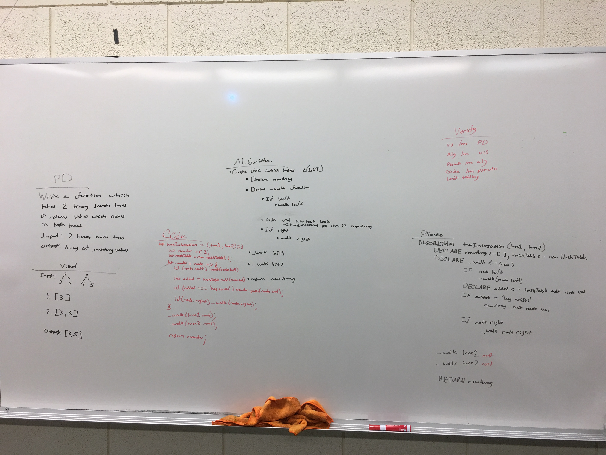

# Challenge Summary
Write a function which takes two binarySearchTrees and returns an array of values which occur in both trees

## Challenge Description
Create a function which declairs a new array and loops over both trees with either loops or recursion in order to compare both trees and push matching values into the new array. 

## Approach & Efficiency
My approach to this algorithm utilizes both recursion and a hashtable. I define a _walk helper method which iterates over tree1's nodes and pushing each value in the tree into the hashtable. Then I use the _walk function to iterate over tree2's nodes pushing each value into the hashtable. If the hash table encounters a key that already exists then it will return a message. When the _walk function encounters this message it pushes that value into the newArr in order to store the value since that value occurs in each tree. At the end the newArr is returned. 

## Solution
